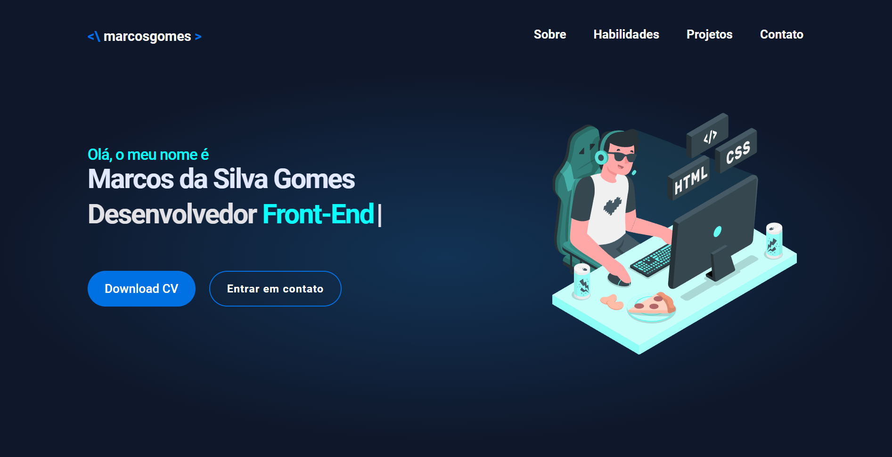
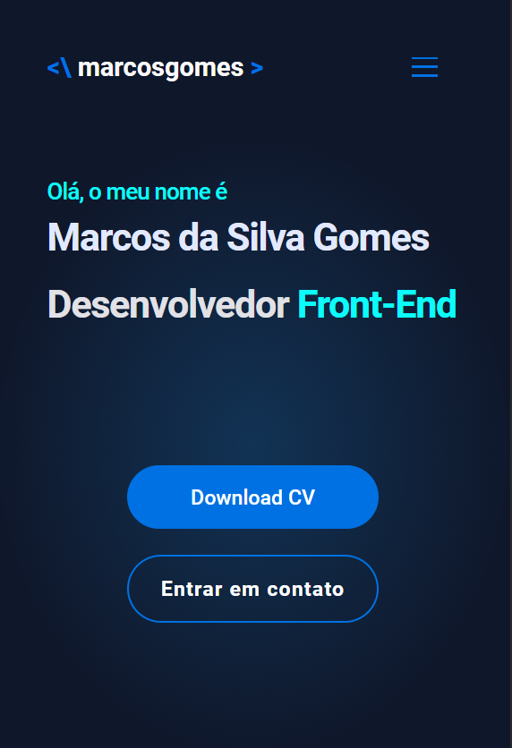

<h1 align="center"> Portfolio </h1>

  <a href="#-tecnologias">Tecnologias</a>&nbsp;&nbsp;&nbsp;|&nbsp;&nbsp;&nbsp;
  <a href="#-projeto">Projeto</a>&nbsp;&nbsp;&nbsp;|&nbsp;&nbsp;&nbsp;
  <a href="#memo-licença">Licença</a>

  

 

<h1>Desktop:</h1>
  
 
<h1>Mobile:</h1>
  

## 🚀 Tecnologias

Esse projeto foi desenvolvido com as seguintes tecnologias:

- HTML e CSS
- JavaScript
- ScrollReveal Js
- TypeIt js

## 💻 Projeto

Este projeto teve como objetivo principal fazer a construção do meu portfolio pessoal, oque é extremamente importante para um desenvolvedor. Nele, pude exibir meus conhecimentos nas tecnologias que domino e apresentar outros projetos que já realizei ao longo do meu processo de aprendizado.

## 📝 Licença

Esse projeto está sob a licença MIT.

---
